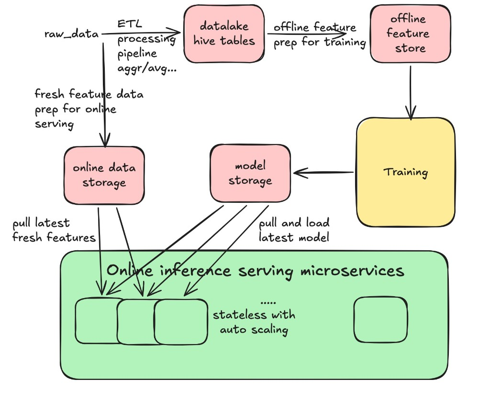
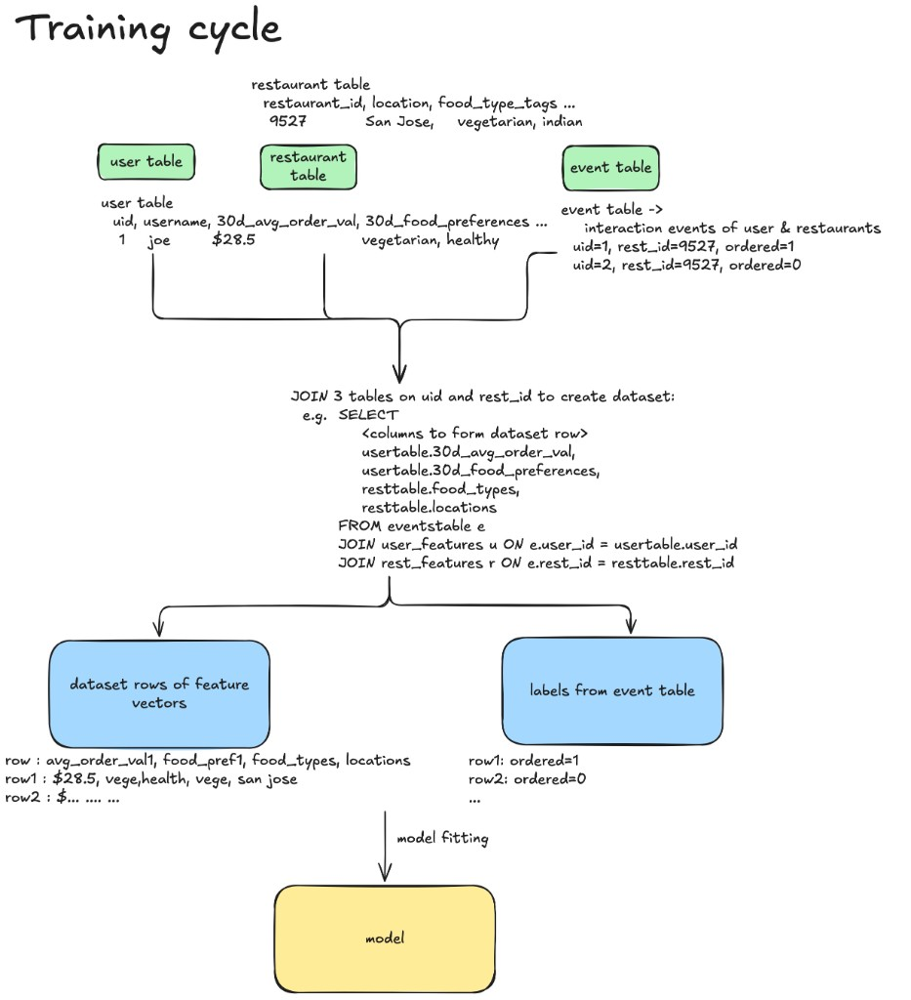
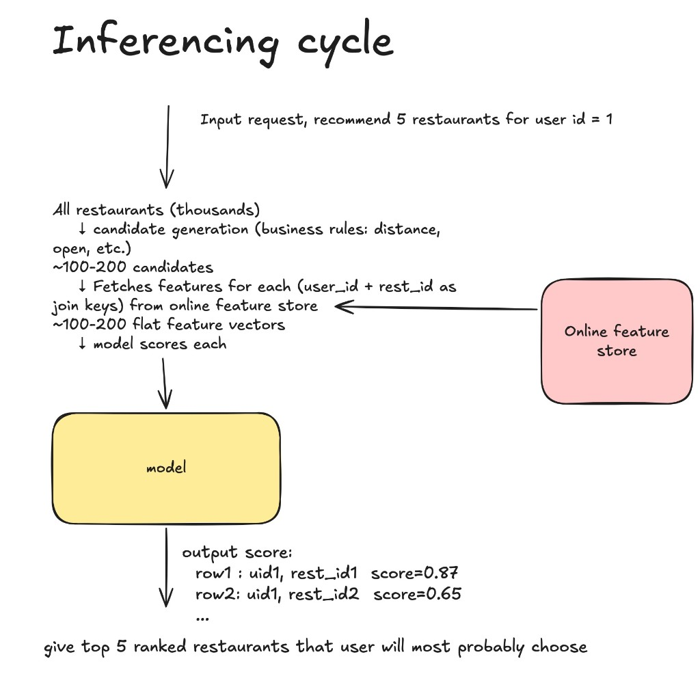

# Chapter 4: ML training/serving Lifecycle - User Restaurant Recommendation example

> **Example system throughout this chapter:** User–Restaurant Recommendation — predict P(order) for each candidate restaurant shown to a user.

---

## Overall Platform Architecture



The platform has two distinct pipelines sharing the same feature definitions:

- **Offline path** — raw data → ETL → data lake (Hive tables) → offline feature store → training
- **Online path** — online data storage (fresh features) + trained model → inference serving microservices

The inference layer is **stateless with auto-scaling** — each serving pod pulls the latest features from online storage and the latest model from model storage independently.

---

## The Data: Three Tables, Three Update Cadences

| Table | Key | Contents | Update frequency |
|---|---|---|---|
| `user_features` | `user_id` | avg order value, food preferences, ... | Weekly |
| `restaurant_features` | `rest_id` | location, food type tags, ... | Hourly |
| `events` | `(user_id, rest_id)` | every impression shown, `ordered=0/1` | Every impression |

The **events table is the spine.** It records every `(user, restaurant)` pair that was actually shown to a user, with `ordered=1` if the user placed an order and `ordered=0` if not. This is the label.

---

## Training Cycle (Offline)



### Step 1 — JOIN three tables on shared keys

The events table drives the join. For every event row, pull the matching user features and restaurant features:

```sql
SELECT
    usertable.30d_avg_order_val,
    usertable.30d_food_preferences,
    resttable.food_types,
    resttable.location,
    eventstable.ordered          -- label
FROM eventstable e
JOIN user_features u  ON e.user_id  = usertable.user_id
JOIN rest_features r  ON e.rest_id  = resttable.rest_id
```

### Step 2 — Output two artifacts

```
dataset rows of feature vectors          labels from event table
────────────────────────────             ──────────────────────
row1: $28.5, vege/health, vege, SJ       row1: ordered=1
row2: $...   ...          ...  ...       row2: ordered=0
...                                      ...
```

The IDs (`user_id`, `rest_id`) are **dropped** after the join — the model trains on pure numeric feature vectors, not on identifiers.

### Step 3 — Model fitting

The model learns to map:

```
[avg_order_val, food_preferences, food_types, location, ...]  →  P(order)
```

The trained artifact is stored in a **model registry** (model storage).

---

## Inferencing Cycle (Online, e.g. target < 50ms)



### Step 1 — Candidate generation

```
Input: "recommend 5 restaurants for user_id = 1"
  ↓
All restaurants (thousands)
  ↓  business rules: distance, open now, cuisine filters
~100–200 candidates
```

This is a coarse filter using cheap rules — no model yet.

### Step 2 — Feature fetch from online FeatureStore

For each of the ~100–200 candidates, fetch:
- `user_features[user_id]` — precomputed user features
- `restaurant_features[rest_id]` — precomputed restaurant features
- Request context computed inline: distance, time of day, etc.

Assemble into the **same flat vector shape** the model was trained on.

### Step 3 — Score and rank

```
model.inference(feature_vectors)  →  scores per candidate

row1: uid=1, rest_id=9527   score=0.87
row2: uid=1, rest_id=1043   score=0.65
...

return top 5 ranked by score
```

The serving layer maps scores back to restaurant IDs and returns the ranked list.

---

## Train-Serve Skew — The Silent Failure Mode

> **The most dangerous bug in ML systems: the model receives inputs at serving time that it was never trained on — and no error is thrown.**

### What causes it

The model learned patterns from features computed a specific way offline (e.g. `30d_avg_order_val` = sum of orders over last 30 days). If the online path computes that same feature differently — different time window, different null handling, different units — the model silently receives wrong inputs.

```
Offline (training):
  30d_avg_order_val = SUM(orders) / 30  using Hive UDF version 1.2

Online (serving):
  30d_avg_order_val = SUM(orders) / 30  using Java service — but nulls handled differently!
                                         model sees 0.0 where it expected NULL → wrong prediction
```

No exception is thrown. Predictions degrade silently.

### How FeatureStore prevents it

FeatureStore is the **single source of truth for feature definitions**, shared between both paths:

```
                    FeatureStore
                  (feature definitions)
                   /               \
        Offline path             Online path
       (Hive / Spark)         (serving microservice)
    same definition →         same definition →
    same computation          same computation
         ↓                          ↓
    training data              serving input
         └──────── model trained and served on ────┘
                   identical feature distributions
```

If the offline and online feature computation ever diverge, FeatureStore catches it at definition time — not at prediction time.

### Chronon — making skew measurable instead of silent

> Chronon originated at Airbnb (previously called **Zipline**) and is now open source. It's a **feature platform** — it handles both feature computation and retrieval, not just storage.

The key difference from a simple feature store (e.g. Redis): Chronon is designed to **structurally solve** train-serve skew, not just prevent it by convention.

**The core mechanism: feature logging + backfill consistency check**

You define features in one place. Those definitions are used for both training data backfills and online serving. Then Chronon enforces consistency through a measurement loop:

```
Online serving
  ↓
FeatureStore returns feature values to the model
  ↓
Chronon logs: {primary keys, timestamp, feature values returned}
  ↓  (offline, asynchronously)
Backfill job: given the same keys + timestamps, recompute features via Hive/batch path
  ↓
Diff: logged online values  vs  backfilled offline values
  ↓
Any divergence = measurable skew  ← no longer silent!
```

In plain terms: every time FeatureStore serves a feature at inference time, Chronon records what was returned. Later, it recomputes those exact same features using the offline batch path and diffs the two. Any mismatch is now a **metric**, not a silent bug.

| Approach | Skew handling |
|---|---|
| Simple FeatureStore (Redis) | Single definition shared by convention — divergence is possible and silent |
| Chronon | Logs every online fetch, backfills offline, diffs continuously — skew is measured and alertable |

---

## Key Terms

| Term | Plain English |
|---|---|
| Feature vector | A flat numeric array representing one training example — all IDs dropped, all values numeric |
| Spine table | The table that drives the JOIN — in this case `events`, one row per training example |
| Train-serve skew | When offline (training) and online (serving) compute the same feature differently — silent degradation |
| Candidate generation / coarse ranking | Coarse filtering step before the model runs — reduces thousands of options to ~100–200 using cheap business rules |
| Model registry | Storage for trained model artifacts — versioned, with metadata |
| Online feature store | Low-latency key-value store for precomputed features, keyed by entity ID (`user_id`, `rest_id`) |
| Offline feature store | Batch-oriented store for historical features used during training (Hive, Parquet, etc.) |
