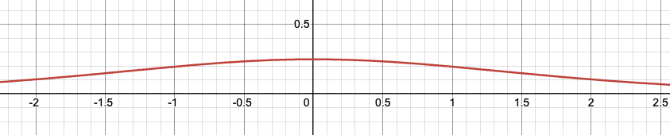

# Backpropagation & 梯度下降 完整笔记

---

## 1. 神经网络的基本结构

神经网络就是一个复合函数，每一层是一个 function：

```
F(x) = fn(fn-1(...f2(f1(x))))
```

每一层的 function 形式都一样：

```
f(x) = activation(W·x + b)
```

- **W**：权重矩阵（float 数组，可正可负）
- **b**：偏置向量
- **activation**：激活函数（人选的，ReLU/Sigmoid/GELU等）

W 的数值不同 = function 行为不同。**训练的过程就是调整 W 和 b 的数值。**

---


## 2. 具体例子

假设两层网络，回归任务，W1代表weight(假设就是one number)

```
输入 x = 2.0，正确答案 y = 10.0
层1：z1 = W1·x,  W1=1.0  → z1 = 2.0
层2：z2 = W2·z1, W2=1.5  → z2 = 3.0
Loss = (z2 - y)² = 49.0
```
目标: 调整 W1 和 W2 让loss变小
$$W1' = W1 + \Delta w$$
Δw应该如何调整？是正（让W变大）是负（让W变小）？
$$\Delta w = - \alpha \cdot \frac{\partial L}{\partial W} $$
α = 在梯度斜坡上跨多大步 AKA Learning Rate
$$Wi' = Wi - \alpha \cdot \frac{\partial L}{\partial Wi}$$

如何求 L对Wi的导数？ChainRule
$$\frac{\partial L}{\partial W_i} = \frac{\partial L}{\partial z_n} \cdot \frac{\partial L}{\partial W_n} \cdot \frac{\partial W_n}{\partial W_{n-1}}  ... \cdot \frac{\partial W_{i+1}}{\partial W_{i}} $$
在这个例子中
$$\frac{\partial L}{\partial W_1} = \frac{\partial L}{\partial z_2} \cdot \frac{\partial z_2}{\partial z_1} \cdot \frac{\partial z_1}{\partial W_1} \\ = 2 \cdot (z_2 - y) \cdot W_2 * x$$

### Forward Pass（记下所有中间值）

```
x=2.0 → z1=2.0 → z2=3.0 → L=49.0
```

### Backward Pass（从 L 往回推）


$$\frac{\partial L}{\partial z_2} = 2 \cdot (z_2 - y) = 2 \cdot (3 - 10) = -14.0$$
$$\frac{\partial L}{\partial W_2} = \frac{\partial L}{\partial z_2} \cdot \frac{\partial z_2}{\partial W_2} = -14.0 \times z_1 = -14.0 \times 2.0 = -28.0$$


$$\frac{\partial L}{\partial W_1} = \frac{\partial L}{\partial z_1} \cdot \frac{\partial z_1}{\partial W_1}  = (\frac{\partial L}{\partial z_2} \cdot \frac{\partial z_2}{\partial z_1}) \cdot \frac{\partial z_1}{\partial W_1} = 2 \cdot (z_2 - y) \cdot W_2 \cdot x \\

= -14.0 \times 1.5 \times x = -21.0 \times 2.0 = -42.0$$


### 更新权重（lr = 0.01）

```
W2 ← 1.5  - 0.01×(-28.0) = 1.78
W1 ← 1.0  - 0.01×(-42.0) = 1.42
```

### 验证（Loss 确实变小）

```
z1_new = 1.42 × 2.0 = 2.84
z2_new = 1.78 × 2.84 = 5.06
L_new  = (5.06-10)² = 24.4   ← 比 49.0 小了很多 ✅
```

---

## 3. Loss Function 的选择

### 为什么不能用 `z2 - y`

**问题1：正负抵消**
```
样本1误差=-2, 样本2误差=+2 → 平均=0，模型以为自己完美了
```

**问题2：梯度大小不随误差变化**
```
∂(z2-y)/∂z2 = 1  ← 永远是1，不管误差多大
```

### MSE：`(z2-y)²`（用于 Regression）

```
∂(z2-y)²/∂z2 = 2(z2-y)

误差大时（z2=3, y=10）：梯度=-14  → 大步更新
误差小时（z2=9.9, y=10）：梯度=-0.2 → 小步微调
```

### Cross Entropy（用于 Classification）

```
L = -log(预测的正确类别概率)
```

对"自信但错误"的预测惩罚极重：
```
预测猫概率=0.01（但正确答案是猫）：
MSE = 0.98   （惩罚不够）
CE  = -log(0.01) = 4.6   ← 惩罚更重，更合理 ✅
```

**选 Loss Function 的原则：** 不同任务对"错误"的定义不同。Regression 输出数字用 MSE，Classification 输出概率用 Cross Entropy。

---

## 3. 权重更新规则


你有一个 W，它产生了错误的答案。问题是：**W 应该变大还是变小？变多少？**

导数回答这个问题——它告诉你 W 往哪个方向变，loss 会下降：

```
∂L/∂W > 0  →  W 增大会让 loss 增大  →  W 应该减小
∂L/∂W < 0  →  W 增大会让 loss 减小  →  W 应该增大
```
***权重更新规则***：
要让W weight权重更新为W' 使得Loss function的值变小
$$W’ = W - α \cdot \frac{\partial L}{\partial W}$$


**减号是统一规则**：梯度指向 loss 上升最快的方向，减去梯度就是往 loss 下降最快的方向走。

- 梯度为负 → 减掉负数 → W 增大 → L 减小 ✅
- 梯度为正 → 减掉正数 → W 减小 → L 减小 ✅


---

## 6. 梯度更新，梯度爆炸与消失

### 权重更新规则
N 层网络，最前层的梯度：


$$\frac{\partial L}{\partial W_i} = \frac{\partial L}{\partial z_n} \cdot \frac{\partial L}{\partial W_n} \cdot \frac{\partial W_n}{\partial W_{n-1}}  ... \cdot \frac{\partial W_{i+1}}{\partial W_{i}} $$

即

$$\frac{\partial L}{\partial W_i} = 2 \cdot (z_n - y) \cdot W_n * \cdot W_{n-1} \cdot W_{n-2} ... \cdot W_1$$


### 问题

```
每个 W = 2.0：梯度 = 2^10 = 1024    → 梯度爆炸，训练崩溃
每个 W = 0.5：梯度 = 0.5^10 = 0.001 → 梯度消失，前层学不动
```

加上激活函数的导数连乘情况更糟（Sigmoid 导数最大 0.25）：

```
10层 Sigmoid：0.25^10 ≈ 0.000001  → 梯度几乎为零
```

**Sigmoid**: 
$$\sigma(x) = \frac{1}{1 + e^{-x}}$$
其导数为
$$\frac{d\sigma(x)}{dx} = \frac{e^{-x}}{(1+e^{-x})^2} =  \sigma(x)(1 - \sigma(x))$$


### 解决方案

**1. ReLU 激活函数**
$$\mathrm{ReLU}(z) = \max(0, z)$$
$$\frac{d}{dz}\mathrm{ReLU}(z) = \begin{cases} 1 & z > 0 \\ 0 & z < 0 \end{cases}$$
正数区域导数恒为 1，不会连乘缩小。

但有 Dying ReLU 问题（负数输出永远归零），改进版：
- **Leaky ReLU**：负数区域给小斜率 $0.01z$
- **GELU**：平滑版，LLM 标配（GPT/BERT 都用这个）

**2. 权重初始化（He Init）**
$$W \sim \mathcal{N}\left(0, \frac{2}{n_{\mathrm{in}}}\right)$$
让每层输出方差保持稳定，不会一开始就爆炸或消失。

**3. Batch Normalization（BN）**
$$z_{\mathrm{norm}} = \frac{z - \mathrm{mean}}{\mathrm{std}}$$
$$z_{\mathrm{out}} = \gamma \cdot z_{\mathrm{norm}} + \beta \quad \leftarrow \gamma、\beta \text{ 是可学习参数}$$
强制归一化每层输出，顺带稳定梯度范围。BN 完全参与链式法则，梯度可以正常穿过。

解决的是 Internal Covariate Shift——每层输入分布不断漂移，BN 把它固定住。

**4. Residual Connection（ResNet）**
$$\text{输出} = f(x) + x \quad \leftarrow \text{跳跃连接}$$
$$\frac{\partial \text{输出}}{\partial x} = \frac{\partial f(x)}{\partial x} + 1$$
永远有 $+1$，梯度至少是 1，不会消失。ResNet 因此可以训练 100+ 层。

---

## 7. 优化器

### SGD（基础）

$$W \leftarrow W - \mathrm{lr} \cdot \frac{\partial L}{\partial W}$$

所有参数用同一个 lr，梯度大小不均时效果差。

### Adam

对每个参数单独维护历史梯度的一阶矩（方向）和二阶矩（大小）：

$$m = \beta_1 \cdot m + (1 - \beta_1) \cdot g \quad \leftarrow \text{梯度均值（方向）}$$
$$v = \beta_2 \cdot v + (1 - \beta_2) \cdot g^2 \quad \leftarrow \text{梯度方差（大小）}$$
$$W \leftarrow W - \mathrm{lr} \cdot \frac{m}{\sqrt{v} + \varepsilon}$$

**效果：**
- 梯度大的参数 → $v$ 大 → 有效 LR 小（自动踩刹车）
- 梯度小的参数 → $v$ 小 → 有效 LR 大（自动加速）

你设的 `lr=0.001` 是全局基础 LR，Adam 在此基础上对每个参数动态缩放。lr 是天花板，实际更新量几乎都比这小。

```python
optimizer = optim.Adam(model.parameters(), lr=0.001)
```

### AdamW

Adam 的问题：Weight Decay（L2正则）被混进梯度后，经过 Adam 的缩放被稀释了，效果不对。

AdamW 把 Weight Decay 从梯度里解耦出来单独处理：

Adam（有问题）：
$$g = \frac{\partial L}{\partial W} + \lambda \cdot W \quad \leftarrow \text{decay 被 Adam 缩放，效果稀释}$$

AdamW（正确）：
$$g = \frac{\partial L}{\partial W}$$
$$W \leftarrow W - \mathrm{lr} \cdot \frac{m}{\sqrt{v}} - \mathrm{lr} \cdot \lambda \cdot W \quad \leftarrow \text{decay 单独作用，不被缩放}$$

GPT、BERT、LLaMA 全都用 AdamW。

---

## 8. 过拟合与泛化

### 什么是过拟合

```
过拟合 ≠ 训练集做得好
过拟合 = 训练集做得好，但新数据做得差
```

表现：
```
Epoch 10： 训练loss=0.5, 测试loss=0.5  ← 正常
Epoch 100：训练loss=0.01,测试loss=0.5  ← 严重过拟合
```

### 终极目标

不是某张卷子满分，是**所有可能遇到的卷子平均分都高**——这叫**泛化（Generalization）**。

如果训练集和测试集都做得好，不叫过拟合，是真的学到了规律。

### Weight Decay 为什么能防过拟合

$$W \leftarrow W - \mathrm{lr} \cdot \frac{\partial L}{\partial W} - \mathrm{lr} \cdot \lambda \cdot W$$

强制让 $W$ 不能太大。大 $W$ = 模型对某些特征极度敏感 = 在训练集抓住每个细节但对新数据噪声敏感。小 $W$ 更保守，只关注最强的规律，泛化更好。

---

## 总结对照表

| 问题 | 原因 | 解决方案 |
|------|------|----------|
| 梯度消失 | Wi<1连乘→0，Sigmoid导数<0.25 | ReLU + ResNet |
| 梯度爆炸 | Wi>1连乘→∞ | 梯度裁剪 + 权重初始化 |
| 数值分布漂移 | 每层输入分布不稳定 | Batch Normalization |
| 负区间信息丢失 | ReLU归零 | Leaky ReLU / GELU |
| LR不自适应 | 所有参数同一LR | Adam / AdamW |
| 过拟合 | 记住训练集细节 | Weight Decay（AdamW） |