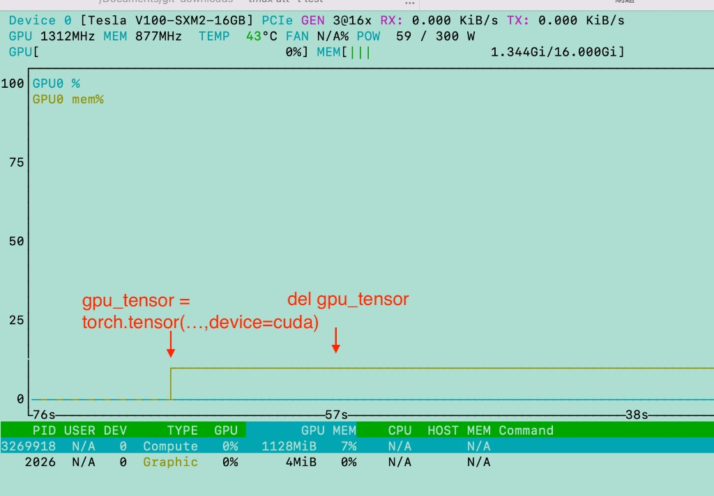
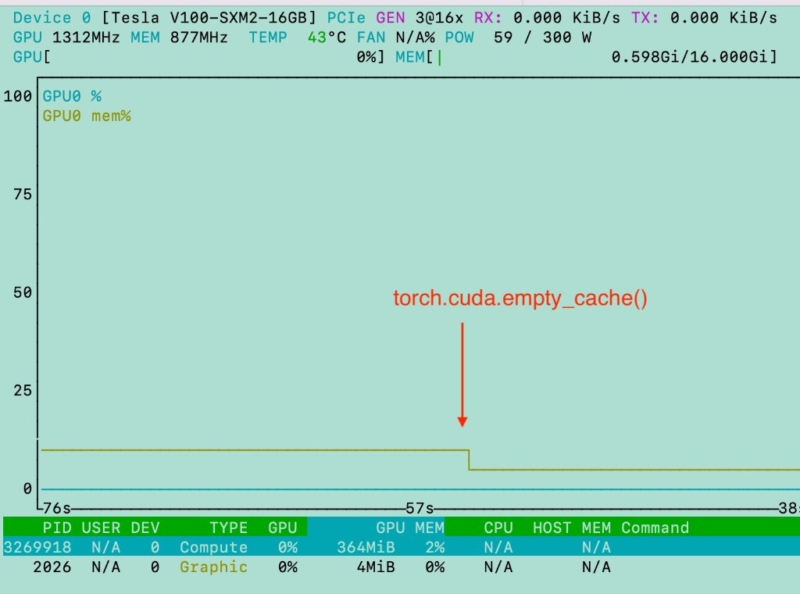

# PyTorch Memory Management: CPU vs GPU

## The Core Difference

| | CPU RAM | GPU VRAM |
|---|---|---|
| Allocator | Python / OS | PyTorch CUDA caching allocator |
| After `del tensor` | Freed immediately (refcount → 0) | **Held in cache**, not returned to driver |
| Visible in monitor | `htop` drops immediately | `nvtop` stays high until `empty_cache()` or process exits |

---

## Experiment

Open two monitors before starting:
```bash
htop -p <your-python-pid>   # watch RES column for CPU RAM
nvtop                        # watch MEM bar for VRAM
```

Then in a Python REPL:

```python
>>> import torch

# --- CPU ---
>>> cpu_tensor = torch.zeros(10000, 20000, device=torch.device("cpu"))
>>> cpu_tensor.device
device(type='cpu')
# htop: RES jumps ~1.5 GB
# nvtop: no change

>>> del cpu_tensor
# htop: RES drops immediately  ← Python refcount hit 0, OS reclaims pages
# nvtop: no change

# --- GPU ---
>>> gpu_tensor = torch.zeros(10000, 20000, device=torch.device("cuda"))
# htop: no change
# nvtop: MEM jumps ~1.5 GB

>>> del gpu_tensor
# htop: no change
# nvtop: MEM stays high  ← PyTorch caching allocator holds the pages

>>> torch.cuda.memory_allocated()   # bytes held by live tensors
0                                    # ← tensor is gone

>>> torch.cuda.memory_reserved()    # bytes held in PyTorch's cache
801112064                           # ← not yet returned to driver

>>> torch.cuda.empty_cache()        # explicitly flush cache back to driver
# nvtop: MEM drops now
```





---


## Why PyTorch Caches CUDA Memory

`cudaMalloc` (allocating from the GPU driver) is **expensive** — it can take milliseconds.
PyTorch avoids calling it on every `torch.zeros(...)` by keeping a pool of freed blocks:

```
torch.zeros(...)
  → check cache for a block of the right size
  → if found: reuse it instantly (no cudaMalloc)
  → if not:   call cudaMalloc (slow path)

del tensor
  → mark block as free in cache
  → do NOT call cudaFree (keep it for next allocation)
```

This is why training loops are fast — after the first few iterations, all allocations
hit the cache and `cudaMalloc` is never called again.

---

## Practical Implications

**`empty_cache()` does not help with OOM inside your own process.**
The cache is private to your process — holding it costs nothing for you.
Only useful when you need to free VRAM for another process.

**`del tensor` is still important.**
Even though VRAM stays reserved, `memory_allocated()` drops, so PyTorch can
reuse that block for the next allocation without going over your GPU's limit.

```python
# Good practice in a benchmark / training loop:
del ids
del outputs
torch.cuda.synchronize()     # wait for GPU ops to finish
# torch.cuda.empty_cache()   # only if handing VRAM back to another process
```

---

## Quick Reference

```python
torch.cuda.memory_allocated()   # live tensor bytes (what you're actually using)
torch.cuda.memory_reserved()    # total bytes held by allocator (what nvtop shows)
torch.cuda.max_memory_allocated() # peak usage since last reset
torch.cuda.reset_peak_memory_stats()
torch.cuda.empty_cache()        # flush cache → returns reserved to driver
```
